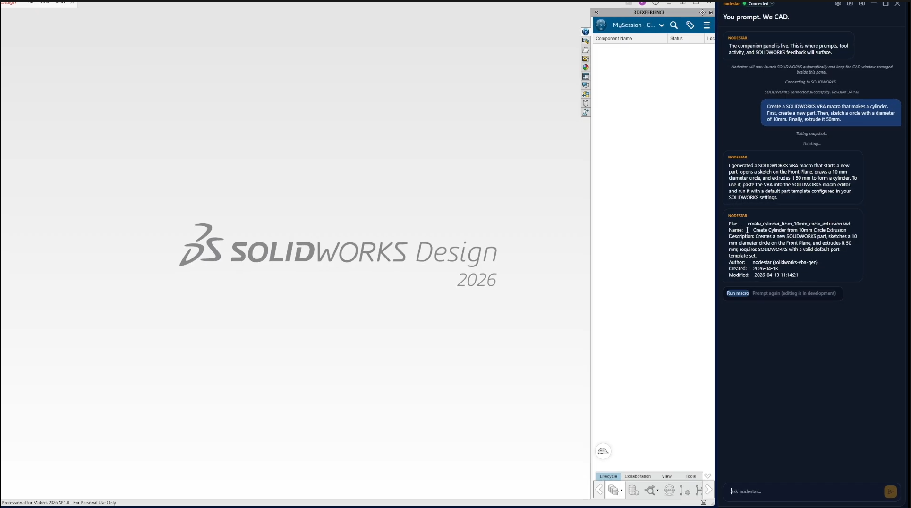

# Nodestar
 
An AI copilot for SOLIDWORKS that turns natural-language requests into runnable VBA macros, executed within your live CAD session.
 

 
## What it does
 
Nodestar sits beside SOLIDWORKS as a chat companion. You type something like "add a 5mm fillet to all edges," and it reads your open model, generates the VBA macro to do it, explains what the macro will do in plain English, and runs it on click. It reduced part generation from around 30s of manual work to under 12s.
 
## How it works
 
Three pieces talk to each other:
 
**SOLIDWORKS bridge.** SOLIDWORKS exposes itself as a COM object, a live handle to the running application that any Windows program can attach to. Nodestar grabs that handle automatically on startup, with no plugin or add-in installed inside SOLIDWORKS. From there it can read the full model state (features, geometry, components, mates) and tell SOLIDWORKS to run macros.
 
**WPF chat app.** The window the user sees. It owns the chat UI, the connection lifecycle (launching or attaching to SOLIDWORKS, detecting crashes), the local slash commands, and the orchestration: snapshot the model, send to the backend, show the response, offer to run the macro.
 
**LLM backend (Railway).** A cloud API that knows the SOLIDWORKS VBA API. The app sends the user's message plus a snapshot of the current session state, and the backend returns generated VBA code with a human-readable explanation. The app never generates VBA itself, so the generation logic can be updated server-side without shipping a new client.
 
## Request flow
 
1. User types a request ("add a 5mm fillet to all edges")
2. Nodestar reads the current model state from SOLIDWORKS and uploads it to Supabase, giving the LLM context on what is actually open
3. The message and snapshot reference go to the Railway backend
4. The backend returns generated VBA plus a plain-English explanation
5. Nodestar saves the VBA as a macro file and shows the explanation in chat
6. User clicks **Run macro**, and Nodestar hands the file to SOLIDWORKS's native macro runner to execute
## Design choices
 
- **No SOLIDWORKS plugin required.** Attaches from outside through a standard Windows COM mechanism SOLIDWORKS already exposes, so there is nothing to install inside the CAD environment.
- **Server-side generation.** VBA generation lives in the backend, so it can be improved without redistributing the app.
- **Inspectable macros.** Macros are saved as plain text files, so users can read, edit, or reuse what was generated rather than trusting a black box.
## Stack
 
C#, .NET, WPF, Supabase, OpenAI API, Railway
 
## Note
 
Built as a team project at a hackathon. The source repository is private.
